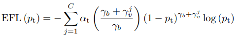

# Equalized Focal Loss for Multilabel Classification

PyTorch 实现

论文原文: https://arxiv.org/pdf/2201.02593.pdf

公式：

latex 公式：

$$
\operatorname{EFL}\left(p_{\mathrm{t}}\right)=-\sum_{j=1}^{C} \alpha_{\mathrm{t}}\left(\frac{\gamma_{b}+\gamma_{v}^{j}}{\gamma_{b}}\right)\left(1-p_{\mathrm{t}}\right)^{\gamma_{b}+\gamma_{v}^{j}} \log \left(p_{\mathrm{t}}\right)
$$
